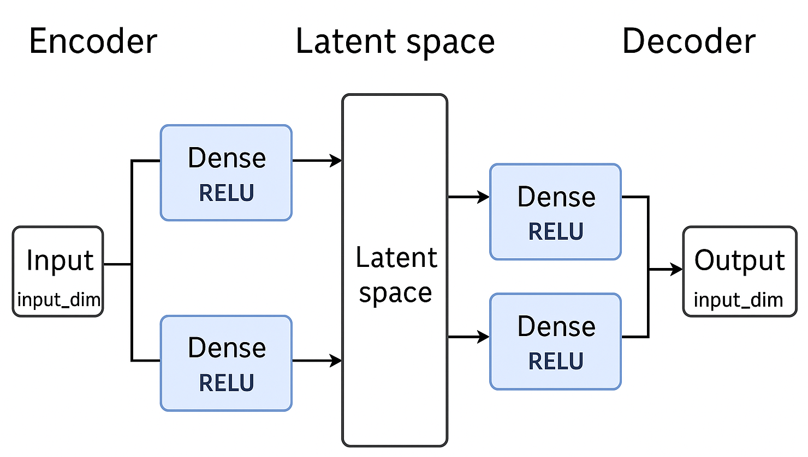

# Autoencoders

An **Autoencoder** is a special type of **neural network** that learns to **recreate its input**.

It takes some input data → compresses it → then reconstructs it again.

You can think of it like a **smart photocopier**:
- It first *understands* the pattern in the data,
- Then tries to rebuild it as close as possible.

---

## Intuition

The main idea is to **learn useful representations** of data without labels.

For example:
- If you feed it thousands of faces, it learns the *essence* of what makes a “face” — eyes, mouth, shape — even without being told what a face is.

Autoencoders are used to **compress** and **denoise** data, not to predict outputs.

Autoencoders don’t predict labels, they understand data.
They’re the foundation of many deep learning innovations like Variational Autoencoders (VAEs) and Transformers.

---

## Example

Let’s say we feed in 2D points that roughly lie on a line.  
An autoencoder can learn to compress those 2D points into just **1 number (latent feature)** — and still reconstruct them accurately.

It means it *understood* the underlying relationship in the data.

---

## Simple Math

We have input data **x**.

1. **Encoder**: compresses input into smaller form →  
   `h = f(W₁x + b₁)`  
   where `h` = hidden (compressed) representation

2. **Decoder**: reconstructs the input back →  
   `x' = g(W₂h + b₂)`  
   where `x'` ≈ `x`

3. **Goal**: minimize reconstruction error  
   `Loss = ||x - x'||²`  
   (called *Mean Squared Error* or *Reconstruction Loss*)

The better the model, the smaller this difference becomes.

---

## Implementation Libraries

You can build autoencoders easily using:
- **TensorFlow / Keras** → beginner-friendly and visual
- **PyTorch** → gives more flexibility and control
- **Scikit-learn** → for simple linear autoencoders (PCA-like)
- **PyTorch Lightning** or **Hugging Face Transformers** → for advanced use cases

Example (in Keras):

```python
from tensorflow.keras.models import Model
from tensorflow.keras.layers import Input, Dense

# Define encoder-decoder structure
input_layer = Input(shape=(4,))
encoded = Dense(2, activation='relu')(input_layer)
decoded = Dense(4, activation='linear')(encoded)

# Build and compile model
autoencoder = Model(inputs=input_layer, outputs=decoded)
autoencoder.compile(optimizer='adam', loss='mse')

# Train model
autoencoder.fit(X, X, epochs=100, batch_size=16)
```
## Steps to Build a Custom Autoencoder

| Step | Description | ML / Maths Concept Involved |
|------|--------------|-----------------------------|
| **1️. Prepare Data** | Generate or collect data. Normalize it (0–1 or -1–1 range). | Data normalization, scaling |
| **2️. Define Architecture** | Choose number of layers and size of bottleneck (hidden representation). | Neural network design, dimensionality reduction |
| **3️. Forward Pass (Encoding → Decoding)** | Pass data through encoder and decoder. | Linear algebra (matrix multiplication), activation functions |
| **4️. Compute Loss** | Measure difference between input (x) and reconstruction (x’). | Mean Squared Error (MSE), L2 norm |
| **5️. Backpropagation** | Compute gradients of loss w.r.t. weights. | Calculus — derivatives, gradient computation |
| **6️. Weight Update** | Update weights using optimizer (e.g., SGD, Adam). | Gradient Descent optimization |
| **7️. Training Loop** | Repeat forward + backward until loss converges. | Iterative optimization, convergence theory |
| **8️. Evaluate** | Test how well it reconstructs unseen data. | Generalization, overfitting control |
| **9️. Visualize Latent Space** | Plot the encoder output (compressed features). | Dimensionality reduction visualization |



In an autoencoder, the middle (bottleneck) layer — called the latent space — is where the model compresses your input data into a smaller, more meaningful form.

The autoencoder consists of two main components:
Encoder: It compresses the input data into a smaller latent representation (a compact “code” that captures the most important patterns).
Decoder: It reconstructs the input back from the latent representation.

Overall, the encoder compresses data → latent space captures key structure → decoder reconstructs it. The smaller the latent space, the stronger the compression (but harder reconstruction).